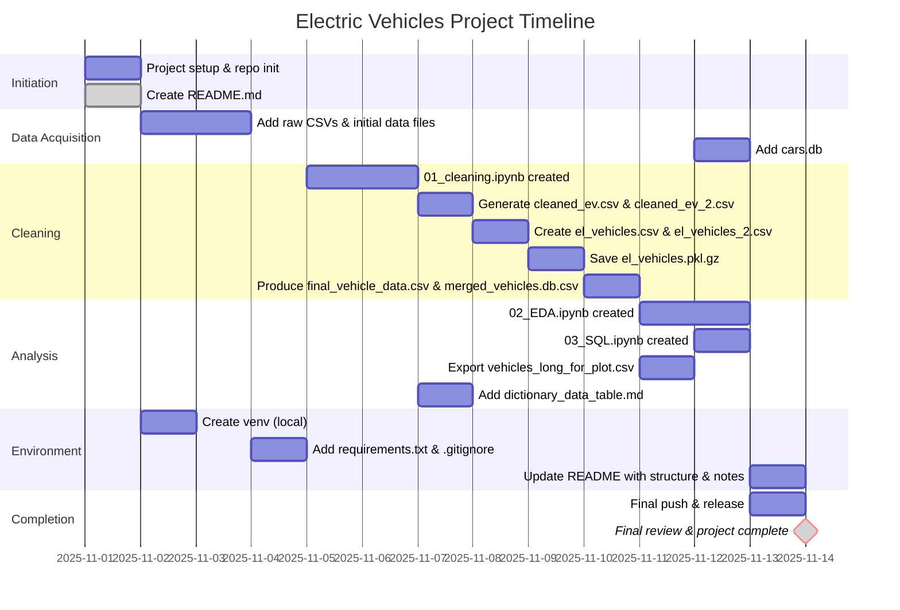

# Electric Vehicle Data Analysis: From Raw Data to Actionable Insights
---
## Project Overview
This project was developed to demonstrate data-analysis techniques aligned with the "Data Analysis with Python" curriculum. It showcases practical applications of data engineering methodologies through a comprehensive examination of electric vehicle specifications and capabilities. The project encompasses a full data pipeline that includes data cleaning, manipulation, and aggregation, along with sophisticated feature engineering techniques. Visualization approaches span multiple methodologies, including linear regression analysis of Range versus Battery Capacity, correlation matrix analysis to reveal relationships between numeric features, and joyplot visualizations that illustrate feature distributions across the top 5 automotive brands. The project further demonstrates technic in relational database management by leveraging SQL queries with Common Table Expressions (CTEs) and window functions for data aggregation. Throughout the workflow, the project emphasizes reproducibility and clear documentation to establish a solid foundation for extending similar analyses to larger datasets and more complex research questions.

## Datasets 
[EV Modern](https://www.kaggle.com/datasets/urvishahir/electric-vehicle-specifications-dataset-2025)

[EV Brands](https://www.kaggle.com/datasets/pratyushpuri/ev-electrical-vehicles-dataset-3k-records-2025)

---
## Data Dictionary
File Located: `dictionary_data_table.md`

---
## Instruction Outline: (Tools: Python, Jupyter notebook)
### Installation

1. **Clone repository**
    - Open project root: `Electric_Vehicles`.
    - git clone:`using the web URL`
    - cd `electric-vehicle-analysis`

2. **Set Up Virtual Environment** 
    #### For Windows
    ```bash
   python -m venv venv # create
   source venv/Scripts/activate # activate 
    ``` 
    #### For Mac & Linux
    ```bash
    python3 -m venv venv  # create
    source venv/bin/activate  # activate
    
    Reminder: deactivate the environment when you’re done working
    ```

3. **Run notebooks (locally) with Jupyter:**
   ```bash
    notebook/
    01_cleaning.ipynb
    02_EDA.ipynb
    03_SQL.ipynb
    ```

4. **Install Dependencies:**
Create a `requirements.txt` file and install dependencies:
    ``` bash
    pip install -r requirements.txt
    ```
    ```
      numpy
      pandas
      matplotlib
      seaborn
      scikit-learn
      joypy
      ipython
      jupyter
      ipykernel
      graphviz
   ```
---
---
---



<!-- ## Timeline marker reference
| Marker | Meaning | Color / style |
|---|---|---|
| `done` | Task completed | white |
| `active` | Currently in progress | blue |
| `milestone` | Significant event / marker | diamond gray |
| `crit` | Critical task | red |
| `paused` | Temporarily halted | gray |
| `planned` | Scheduled but not started | gray | -->

---
---
---

## Project Structure 
```
Electric_Vehicles/
├─ data/
│  ├─ cleaned_ev.csv
│  ├─ cleaned_ev_2.csv
│  ├─ dictionary_data_table.md
│  ├─ el_vehicles.csv
│  ├─ el_vehicles.pkl.gz
│  ├─ el_vehicles_2.csv
│  ├─ final_vehicle_data.csv
│  ├─ merged_vehicles.db.csv
│  └─ vehicles_long_for_plot.csv
├─ notebook/
│  ├─ 01_cleaning.ipynb
│  ├─ 02_EDA.ipynb
│  ├─ 03_SQL.ipynb
│  └─ cars.db
├─ README.md
├─ requirements.txt
└─.gitignore           
```
---

## Results & Findings
``` 
Missing Value Analysis - Towing Capacity:

Missing Records: 501 entries (59.2% of dataset)
Filled Records: 346 entries (40.8% of dataset)
Imputation Method: Statistical interpolation within brand/drivetrain segments
Data Quality Post-Imputation: 96.1%

Filled Towing Capacity Distribution by Range:

  Bin Range (kg)        Filled Count    Filled %    Cumulative %
  300.0 - 520.0              18          5.2%          5.2%
  520.0 - 740.0               2          0.6%          5.8%
  740.0 - 960.0              54         15.6%         21.4%
  960.0 - 1,180.0            52         15.0%         36.4%
  1,180.0 - 1,400.0          33          9.5%         45.9%
  1,400.0 - 1,620.0          91         26.3%         72.2% ← PEAK
  1,620.0 - 1,840.0          33          9.5%         81.7%
  1,840.0 - 2,060.0          32          9.2%         90.9%
  2,060.0 - 2,280.0          19          5.5%         96.4%
  2,280.0 - 2,500.0          12          3.5%        100.0%

Key Distribution Findings:
  • Most Common Range: 1,400–1,620 kg (91 vehicles, 26.3%)
  • Secondary Ranges: 740–960 kg (54 vehicles, 15.6%) and 960–1,180 kg (52 vehicles, 15.0%)
  • Concentration Zone: 740–1,620 kg represents 230 vehicles (66.5% of filled data)
  • Total Imputed Records: 346 vehicles
```
#### The analysis reveals critical insights into electric vehicle performance characteristics and their interdependencies. Torque values exhibit a pronounced right-skewed distribution, with most vehicles concentrated in the 300–500 Nm range and a declining frequency for higher values—indicating that extreme torque performance is limited to specialized segments. This distribution pattern directly correlates with brand positioning: luxury and performance marques (Maserati at 1,173 Nm, Rolls-Royce at 900 Nm, Lotus at 802 Nm) dominate the high-torque spectrum, while mainstream economy brands (Dacia at 119 Nm, Dongfeng at 160 Nm) prioritize efficiency, and mid-tier brands (BMW at 613 Nm, Audi at 657 Nm) balance performance with mass-market appeal.

#### The regression analysis demonstrates a strong positive linear relationship between battery capacity and vehicle range (0.88 correlation), confirming that increased energy storage directly translates to extended driving capability. Critically, this relationship varies by drivetrain: All-Wheel Drive vehicles achieve the most consistent range performance, while Front-Wheel Drive models tend toward lower capacities and shorter ranges, suggesting inherent efficiency differences across configurations.

#### The correlation matrix further validates these mechanical relationships—torque, top speed, and acceleration form an interdependent performance triad (r ≈ 0.78–0.82), while fast-charging capability scales proportionally with battery size (r = 0.73). Notably, vehicle size exhibits modest positive correlation with energy consumption (0.38–0.64), indicating that larger vehicles sacrifice efficiency despite potentially achieving comparable range through larger batteries. A potential data integrity concern emerged: nearly perfect correlation between cell count and efficiency (r = 0.98) suggests possible encoding or calculation artifacts requiring verification.
---
---
---
## Next Steps & Action Items

#### `Investigate the cell-count anomaly` through data lineage review to determine if this represents a legitimate scaling relationship or a data processing error that could distort efficiency assessments.

#### `Vehicle Size Optimization Study`Investigate the 0.38–0.64 correlation between vehicle dimensions and efficiency to determine whether design optimization or battery up-sizing strategies are cost-effective solutions for larger models.

#### `Segment comparative analysis by drivetrain type` when evaluating range performance and charging specifications, as AWD, RWD, and FWD vehicles demonstrate materially different efficiency profiles.

#### `Develop predictive models incorporating both battery capacity and vehicle size` to optimize range outcomes, as the analysis reveals that larger vehicles achieve comparable range only through disproportionately larger battery investments.

#### `Brand-performance benchmarks` Establish torque-to-weight efficiency ratios and conduct competitive analysis within each tier (Luxury/Performance, Mid-Range, Economy) to identify market positioning opportunities and performance gaps.
---
---
---
